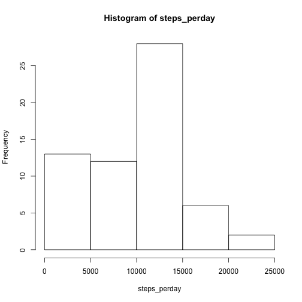
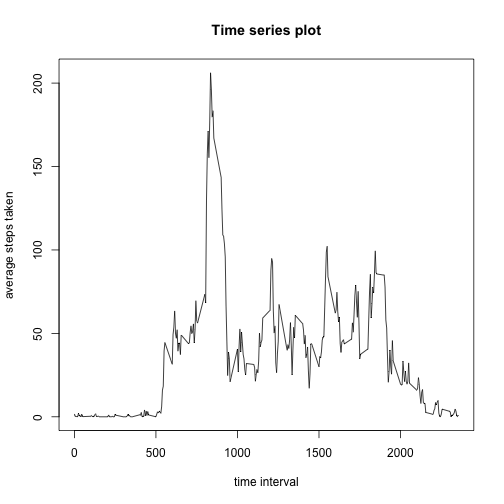
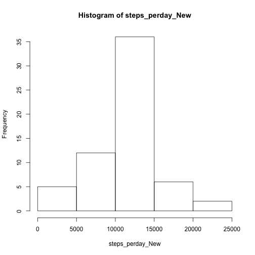
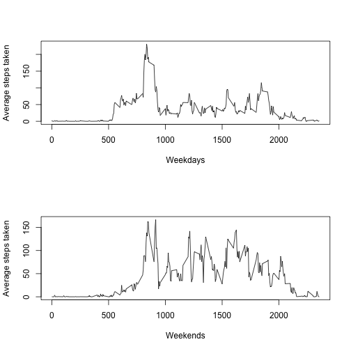

This is my Peer Assignment 1 
============================

There are five parts in my submission.

### Part1: load and preprocess the data

The data was already downloaded to my working directory.


```r
data <- read.csv("activity.csv")
```

### Part2: mean total number of steps

This part calculates the total number of steps taken per day, makes a histogram and reports the mean/meidan.


```r
steps_perday <- tapply(data$steps, data$date, sum, na.rm = T)
hist(steps_perday)
```

 

```r
mean <- mean(steps_perday)
median <- median(steps_perday)
```

The mean total number of steps taken per day is **9354.2295082**,
and the median total number of steps taken per day is **10395**.

### Part3: average daily activity pattern

This part makes a time series plot and will find the maximum interval.


```r
steps_interval <- tapply(data$steps, data$interval, mean, na.rm = T)
plot(names(steps_interval), steps_interval, type = "l", xlab = "time interval", ylab = "average steps taken")
title("Time series plot")
```

 

```r
index <- which(steps_interval == max(steps_interval))
start_interval <- as.numeric(names(index))
end_interval <- start_interval + 5
```

The maximum number of steps exist in the interval from **835** to **840** minutes.

### Part4: missing values

Here my strategy is to fill in all missing values with the mean for that 5-minute interval.
The new dataset is called **data_New**.


```r
rows_NA <- sum(is.na(data$steps))

data_New <- data
steps_interval_New <- tapply(data_New$steps, data_New$interval, mean, na.rm = T)
index_NA <- is.na(data_New$steps)
for(i in 1 : length(index_NA)) {
    if(index_NA[i])
        data_New$steps[i] <- steps_interval_New[[as.character(data_New$interval[i])]]
}

steps_perday_New <- tapply(data_New$steps, data$date, sum)
hist(steps_perday_New)
```

 

```r
mean_New <- mean(steps_perday_New)
median_New <- median(steps_perday_New)
```

The total number of missing values is **2304**.  
The new mean total number of steps taken per day is now **1.0766189 &times; 10<sup>4</sup>**,
and the new median total number of steps taken per day is now **1.0766189 &times; 10<sup>4</sup>**.  
These values are larger than the results of Part1. The imputing of missing values makes the histogram more symmetrical based on my filling strategy.

### Part5: weekdays vs weekends

This part shows two subplots of average steps per day. 


```r
data_New["Day_factor"] <- NA
for(i in 1 : length(index_NA)) {
    day <- weekdays(as.Date(data_New$date[i]))
    if(day == "Saturday" || day == "Sunday")
    data_New$Day_factor[i] <- "weekend"
    else data_New$Day_factor[i] <- "weekday"
}

steps_average <- tapply(data_New$steps, list(data_New$interval, data_New$Day_factor), mean)
par(mfrow = c(2, 1))
plot(rownames(steps_average), steps_average[, 1], type = "l", xlab = "Weekdays", ylab = "Average steps taken")
plot(rownames(steps_average), steps_average[, 2], type = "l", xlab = "Weekends", ylab = "Average steps taken")
```

 
